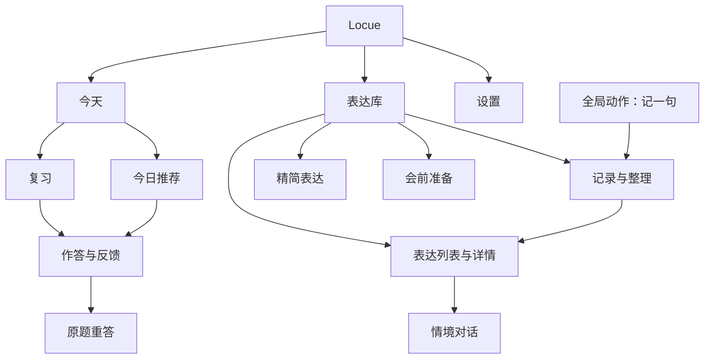
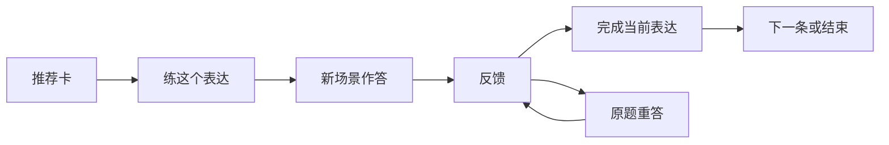

# Locue · 产品需求与实施路线

> 版本：v2.0 · 更新：2026-09-18
> 当前实现基线：`0a503fb`，Android 预览版 0.4.1 / versionCode 14。Android 优先，Web 共享产品逻辑。
> 本文是产品需求、完成状态、验收要求和实施顺序的唯一维护入口。新设计直接补入相应章节，已完成项保留并更新状态。
> **当前位置：阶段 A—D.5 已完成；阶段 E 的自动化、浏览器、真实模型、Android 构建及 Android 16 模拟器验收已通过，实体设备与 14 天真实使用观察仍在进行。专业词汇不新增一级入口，与表达共用推荐、练习、调度和掌握证据。**

## 阅读导航

- [0. 当前状态与完整功能路线](#status)
- [1. 产品定位、原则与边界](#principles)
- [2. 用户旅程与信息架构](#navigation)
- [3. 今天、推荐与复习](#today)
- [4. 全局速记与中断恢复](#capture)
- [5. 表达库、整理与工具](#library)
- [6. 教学反馈与原题重答](#feedback)
- [7. 学习引擎与情境对话](#learning)
- [8. 状态、数据与服务约束](#state)
- [9. 文案、视觉与可访问性](#visual)
- [10. 验收、效果评估与风险](#acceptance)
- [11. 分期实施与当前起点](#roadmap)
- [12. 决策记录与文档维护](#maintenance)

## 0. 当前状态与完整功能路线

### 0.1 状态口径

| 状态 | 含义 |
| --- | --- |
| 已完成 | 对应实现已在基线版本中存在；具体平台和验证范围以本章及验收章节为准 |
| 部分完成 | 已有基础能力，但仍有明确的需求或交互缺口 |
| 待实施 | 设计已纳入路线，基线版本尚无完整实现 |
| 待验证 | 已有实现或设计假设，缺少对应的真实服务、实体设备或长期使用证据 |
| 后续规划 | 保留方向及进入条件，不进入当前开发批次 |

“已完成”不等于所有设备和模型均已验证；设计写入本文也不等于已经上线。后续正文描述**目标行为**，实际完成情况统一看本章，不从一段流程描述推断状态。

### 0.2 原始功能路线 F1—F25

保留原编号，方便查阅历史；原 P0/P1/P2 与 W1—W4 是历史优先级，当前顺序以第 11 章为准。

| ID | 能力 | 当前状态 | 已有实现与剩余工作 |
| --- | --- | --- | --- |
| F1 | 快速记录 | 部分完成 | 已有全局独立“记一句”面板、离线记录、独立草稿、收起/存好/另记一句和桌面快捷入口；待完成真机耗时、语音尾包及中断返回实测 |
| F2 | 待处理记录 | 已完成 | 记录已迁入表达库，区分草稿、待整理、正在整理、待查看、整理失败和已处理；支持整理、精简、保留与删除，处理后原记录可回看 |
| F3 | 译写、改写、衍生分析 | 已完成 | 支持原句保留、必要纠错、可选优化、空骨架、复用已有条目和新增骨架的完整契约 |
| F4 | 首次主动产出 | 已完成 | 收录后造句、文本判卷、统一尝试记录和反馈后原题重答已接通；保留记录或完成整理不强制入库、造句 |
| F5 | 固定阶梯复习 | 已完成 | `0 / 1 / 3 / 7 / 21 / 60` 天，失败退一阶并 8 小时后重来；完整会话幂等结算另见 F29/F31 |
| F6 | 分阶段召回 | 已完成 | 第 0—2 阶指导练习，第 3—5 阶隐藏英文提示；今天页直接作答并冻结最多 5 条的短组 |
| F7 | 真实使用与掌握状态 | 已完成 | 用户主动记录真实使用；`box >= 4 && realUses >= 3` 才达到掌握条件 |
| F8 | 精简表达 | 已完成 | 支持段落精简、零新增正常出口、骨架提炼、记录来源返回、最近任务恢复及不入库的原意脱稿重述；压缩率只作事实展示 |
| F9 | 会前准备 | 已完成 | 已有按会议情境生成建议、优先复用、热身入口和最近一次输入/结果/请求状态恢复；跨会议历史仍按范围后置 |
| F10 | 表达库 | 已完成 | 已有表达/记录分区、本地搜索、状态筛选、详情、归档、学习记录及固定工具入口；搜索条件、分区、筛选和返回位置在当前运行期保留 |
| F11 | 学习偏好 | 已完成 | 已有画像配置，设置和推荐均可进入；命名统一随 F30 完成 |
| F12 | 模型接入与自检 | 已完成 | 区域 Profile、高级兼容配置、模型与语音双 Key、首启文本/ASR/TTS 验证；不改为旧版“三个空框、可跳过” |
| F13 | 本地通知 | 已完成 | 到期提醒、降频、权限引导和通知跳转；Android 16 模拟器已通过七日调度、重启恢复与深度 Doze 精确提醒，真实锁屏和厂商省电差异仍待实体设备验证 |
| F14 | 持久化与备份 | 已完成 | Android SQLite、Web IndexedDB、安全凭证存储、每日备份与导入导出；当前状态格式 v12，Web fixture 已验证 v11 升级，Android 16 模拟器已验证同发布签名覆盖安装、杀进程/重启恢复及旧数据、草稿和凭证保留，仍需实体设备覆盖升级 |
| F15 | 系统分享捕获 | 部分完成 | Android 文本摄取、分享不清空草稿且不抢当前练习路由已完成；Android 16 模拟器系统选择器已验证文本落入独立记录，仍需实体设备验证重复投递和厂商选择器差异 |
| F16 | 通知内快捷回复 | 已完成 | 已有收取文本、回前台判卷链路；Android 16 模拟器通知栏回复已恢复同一题并预填答案，真实锁屏回复和连续使用待验证 |
| F17 | 语音输入与朗读 | 已完成 | 系统/云端模式、区域语音、可编辑转写与降级；误导性语音评分已下线。真人识别质量和时延待验证 |
| F18 | 提示词评测与回归 | 部分完成 | 已有评测脚手架、契约测试和部分真实云端走查；20—30 条个人真实语料、完整质量基线与持续回归待补齐 |
| F19 | 个人表达问题档案 | 后续规划 | 聚合 3—5 类反复出现的问题，针对性练习；需先有可信反馈和真实样本 |
| F20 | 两轮情境对话 | 已完成 | 独立会话、两轮交互、恢复、判定、单次调度及指定回合局部重答已实现；真实评测集和两周训练价值待验证 |
| F21 | 会后回收 | 后续规划 | 显式授权后考虑日历联动，会议结束约 20 分钟后轻量回访；不默认监听会议 |
| F22 | 飞书机器人入口 | 后续规划 | 聊天中记录表达的便利入口；不替代现有本地通知 |
| F23 | 单向语料导入 | 后续规划 | 从用户主动提供的英文邮件、文档中发现可改进表达和高频问题 |
| F24 | 多设备 | 后续规划 | 优先评估用户自有网盘与文件备份；先解决一致性、冲突和恢复，不能直接把运行中的 SQLite 文件互相覆盖 |
| F25 | 月度输出体检 | 后续规划 | 新增表达、掌握与真实使用变化、表达问题变化；不以时长或收藏量充当学习收益 |

### 0.3 后续新增需求

| ID | 能力 | 当前状态 | 本轮范围 |
| --- | --- | --- | --- |
| F26 | 每日推荐与场景迁移 | 已完成 | 推荐生成、收录、换场景练习、进度同步、今天内模式切换、显式开始、完成结算及跨日原题恢复已实现；旧批次不占新一天进度，真实连续使用效果待验证 |
| F27 | Locue 品牌与基础视觉 | 已完成 | 英文品牌、移调引号图标、C1 湖蓝/C4 墨青、圆角、两目的地导航与键盘态速记入口已交付 |
| F28 | 可信反馈与可选优化 | 已完成 | 误导性语音评分已下线；捕获、普通判卷和原意重述已统一 `keep/correct/optional`，并支持 `none/reuse/new` 准入与无新骨架正常完成 |
| F29 | 原题重答与转写修订 | 已完成 | 普通练习、查看答案、精简和对话局部重答已接通；最多两次有效重答，首答/重答分开记录，语音原转写与确认文本分离，同会话只结算一次 |
| F30 | 主线与信息架构重组 | 已完成 | 今天/表达库两个目的地、全局记一句、今天内复习/推荐、默认选择、短组与分层结束状态已实现 |
| F31 | 统一会话与异步保护 | 已完成 | 普通练习已持久化题面、答案、尝试、来源与结算快照；判卷绑定会话/尝试并幂等结算，晚回调不抢页面，通知与各练习入口均有独立来源 |
| F32 | 工具任务恢复 | 已完成 | 精简与会前输入、结果和请求状态均持久化；返回页面不重复请求，重启时未完成请求转为可重试状态，不扩展成会议管理系统 |
| F33 | iOS 平台交付 | 后续规划 | 共享业务逻辑，单独验收壳、权限、分享扩展、语音与签名；不视为 Android 已完成的附带成果 |
| F34 | 托管身份、额度与模型代理 | 后续规划 | 正式多用户服务的条件路线：托管 OIDC + PKCE、短期令牌、额度和代理；当前单用户客户端不新增后端 |
| F35 | 专业词汇与表达联动 | 已完成 | 以统一学习单元承载表达和专业词汇；旧数据默认表达，推荐目标约 4 表达 + 1 词汇，词汇不足不硬凑；表达库筛选、详情、搜索、场景产出练习与 v12 迁移已通过自动化、浏览器和真实模型验收 |

### 0.4 当前证据与未验证事项

2026-09-18 阶段 E 自动化批次已完成 31 个测试文件、171 项自动化测试、类型检查、生产构建与 `git diff --check`。新增覆盖跨日未完成推荐恢复、旧批次与新日进度隔离、桌面快捷速记、分享不抢当前路由、通知回复优先、后台落盘和键盘优先返回。真实方舟模型通过应用原始 `recommendDaily()` 契约生成 5 个学习单元，其中 4 个表达、1 个专业词汇；词汇具备明确义项、4 个搭配、锚点句、3 个领域标签，迁移练习答案实际使用目标词。

隔离浏览器 fixture 在 320 / 390 / 600 / 1280px 视口验证了当前两目的地导航、全局速记草稿跨页与重启、推荐浏览与练习、离线自评、工具入口和横向溢出；REC-05 专项另在 320 / 390 / 600px 验证了昨日答案恢复、刷新持久化、离线结算、完成后进入新一天，以及旧牌组 `practicedAt` 不变。`npm run android:debug` 已重新完成 Capacitor 同步和 Debug APK 构建。以上是可执行端验收，不替代实体设备验证。

Android 16 / API 36 模拟器（1080×2424，density 420）已用既有发布签名的 0.4.1 / versionCode 14 APK 完成覆盖安装，旧 SQLite、速记草稿、练习答案、表达和安全凭证均保留。设备级走查通过全局速记自动聚焦、返回键先收键盘再关面板、`sayable://capture`、强制停止及重启恢复、系统分享选择器、分享文本进入“待查看”且不抢当前练习、测试通知点击跳题、通知栏快捷回复、未来 7 天调度及 `BOOT_COMPLETED` 恢复。临时授予精确提醒权限后，模拟器在未加入电池优化白名单且处于深度 Doze 时准点投递；测试后已恢复通知关闭、21:30 提醒时间和默认精确权限。

真实服务已走通：普通判卷、通过但需纠正、两轮情境对话及恢复、生成 5 条推荐并完成其中 1 条、专业词汇 4+1 推荐、同日重复成功不再升阶、ASR 鉴权与 TTS、原生录音开始/停止、通知点击和分享摄取。既有代码与 APK 已在预览发布中同步；本次阶段 A—E 改动尚未提交或发布。

| 待验证项 | 仍需证据 |
| --- | --- |
| 真人语音 | 真实口述准确率、口音/噪声/蓝牙、停止说话到 final 的 P95；鉴权和采集成功不等于识别质量合格 |
| 触达 | 模拟器已覆盖通知栏快捷回复、Doze、重启和系统分享选择器；仍需实体设备锁屏、厂商省电/选择器差异及连续 7 天 |
| 模型质量 | 完整反馈案例、20—30 条个人语料、20 个对话触发场景；精简与会前质量不能由普通判卷推定 |
| 学习效果 | 连续 7—14 天使用、换场景表达与真实使用；不能由测试数量或截图证明 |
| 本轮新动线 | 阶段 A—D.5 已完成，阶段 E 的自动化、浏览器、Android 构建和 Android 16 模拟器验收已通过；REC-05 设备跨午夜、实体设备矩阵及 14 天观察仍未完成 |

## 1. 产品定位、原则与边界

### 1.1 问题与核心价值

目标用户是能读懂英语、能开会，但没有整块学习时间的专业人士：听到好表达很快忘记；真正开口仍调用熟悉的简单词和中文组织方式；为交代信息不断补充，表达变长；认识的词说不出来。

Locue 是英语表达训练工具，核心价值是：**把好表达变成你的表达。** 通过“检索—重组—复用”拓宽主动调用通道，而非要求每天投入一小时或不断增加知识量。

长期过程：**遇到或获得表达 → 理解用法 → 换场景主动产出 → 间隔复习 → 在真实沟通中使用。**

学习单元以可复用骨架为主，例如 `The bottleneck has shifted from X to Y.`，从原场景迁移到代码评审或数据质量。但一次记录、译写或精简可以正常结束而不创建骨架。

### 1.2 产品原则

| 原则 | 要求 |
| --- | --- |
| 主线服务高频意图 | 日常打开直接练推荐或复习；不要求每次先捕获 |
| 捕获低阻力 | 先本地保存再返回；不等待联网、分析、选择类型或评分。2 秒是交互愿景，具体测量见第 10 章 |
| 记录与学习分开 | 草稿、原始记录、分析结果和学习表达是不同对象；保存不等于收录或掌握 |
| 主动产出形成闭环 | 邀请一次换场景产出；完成整理不强制练习，阅读或收录不计为已练 |
| 原句可以保留 | 无必要问题时不制造诊断；必要纠错与可选优化分开，允许零新增或复用 |
| 每周建议 15 条 | 不设硬上限；超出建议量自动错峰安排首次后续复习 |
| 真实使用才能掌握 | 固定阶梯达到第 4 阶及以上，并累计 3 次真实使用；训练、意向和模型判定不能冒充真实使用 |
| 一次聚焦一个骨架 | 单次练习只练一个目标；无价值时可以不给。会前多条候选仍由用户选一条热身 |
| 稳定入口与明确结束 | 频率决定首页权重，紧急性决定入口距离；完成即收拢任务，不自动追加待办 |
| 进度诚实 | 自评、提示后重答、转写修订和独立首答分别记录；服务故障不算答错 |

### 1.3 当前问题与本轮目标

用户自述约 90% 的使用是今日推荐与复习。这是核心用户的定性反馈，不代表全量统计。现有首页速记置顶，待处理、工具、统计和最近添加分散注意力；底部五项混用页面、创建动作和具体方法。草稿的紧急性变成长期占屏，完成边界和中断恢复也不够明确。

| 目标 | 验收方向 |
| --- | --- |
| G1 主线清楚 | 第一屏识别复习和推荐，知道当前可开始什么 |
| G2 高频路径直接 | 两种练习在今天内切换，无推荐目录页或必经长滚动 |
| G3 随时捕获 | 已配置应用的主要页面，一次点击进入速记 |
| G4 可恢复 | 页面切换、速记、后台与重启后恢复有效状态 |
| G5 工具好找 | 精简和会前准备有固定名称及入口 |
| G6 完成即收束 | 完成内容退出当前队列，剩余任务和结束状态如实呈现 |
| G7 教学不退化 | 场景迁移、分阶段提示、可信反馈与调度边界保留 |

### 1.4 范围边界

本轮重组入口并补齐学习反馈、任务恢复；继续使用 Capacitor 与现有前端、存储及模型接口，不顺带更换供应商、首启策略、权限体系、阶梯算法或引入新后端。

当前不做：发音能力评分、语法课程体系、词汇量测试、知识图谱、embedding 检索、排行榜、社交、连续打卡、多人协作、无限对话、默认后台录音或日历监听。每日少量个性化推荐保留，不扩展为无穷内容流。

身份认证、计费代理、多设备、iOS 属于条件式后续路线，不再写成“永远禁止”，也不因此提前进入本轮。发音评测若将来确有需求，必须另立可靠专项服务需求，不能恢复已下线的启发式分数。

## 2. 用户旅程与信息架构

### 2.1 三类打开意图

| 意图 | 落点 | 成功离开条件 |
| --- | --- | --- |
| 日常练习 | 今天：继续未完成任务，或选择复习/推荐 | 自己表达、查看反馈、按需重答，完成一条或一组；随时可结束 |
| 临时记录 | 记一句：输入或手动启动语音 | 文本可靠保存，回到原场景 |
| 任务应用 | 表达库、精简表达或会前准备 | 找到可用表达、得到可保留结果或完成一条热身 |

练习途中记录：保存当前答案 → 打开独立速记 → 存好 → 回到原题、原阶段和原输入，不自动跳到整理页。会前准备：描述对象/主题/关注点 → 优先复用已有表达 → 选一条热身 → 保留本次准备 → 真实沟通后再记录使用。

### 2.2 两个目的地，一个全局动作

| 位置 | 名称 | 类型 | 作用 |
| --- | --- | --- | --- |
| 左 | 今天 | 页面 | 推荐与复习 |
| 中 | ＋记一句 | 动作 | 独立记录面板，不具有页面选中态 |
| 右 | 表达库 | 页面 | 查找表达、整理记录、使用工具 |

速记必须有文字标签，不只显示加号。打开后原目的地选中态不变。设置在顶栏右侧，学习偏好也可从推荐模式进入；点击品牌返回今天前保存当前输入。

### 2.3 到达成本

从今天的稳定页面计算，不含输入和滚动：默认练习无额外目录导航；切换推荐 1 次；速记 1 次；进入可搜索的表达库 1 次；记录、精简、会前准备各 2 次。工具必须位于表达库第一屏，不藏在多层“更多”中或长列表末尾。

### 2.4 键盘、面板、返回与深链接

- 键盘展开时收起底部页面导航，在输入区附近保留轻量“记一句”；单屏只出现一个速记入口，速记内部不再嵌套速记。
- 从详情等面板记一句时保存原面板，视觉上只保留一个前台面板；关闭后恢复。
- Android 返回优先关闭键盘，再关闭速记/详情，再回到页面来源；关闭前持久化。最外层今天无面板、无键盘时才退出 App。
- 通知直达对应练习，桌面快速记录直达速记；明确外部意图优先于普通启动默认项，同时保留原未完成会话。
- 保留既有首启接入面板的不可关闭策略；一点速记的验收前提是已完成初始配置。

## 3. 今天、推荐与复习

### 3.1 第一屏与默认选择

固定从上到下：紧凑品牌/设置顶栏 → 今天及必要的继续状态 → “复习 / 今日推荐”及各自进度 → 当前一题或一张推荐卡 → 当前主动作 → 底部导航。

移出首页常驻内容：展开的速记框、待处理列表、累计统计、最近添加和工具列表。删除暗示固定先后顺序的“先记下来，再把表达练熟”。两个模式的位置不随状态交换，完成后仍可切换查看。

| 优先级 | 条件 | 落点 |
| --- | --- | --- |
| 1 | 通知、快捷方式等明确意图 | 对应任务 |
| 2 | 上次未完成的日常练习会话 | 原模式、题目、阶段 |
| 3 | 本次使用中用户刚选择过模式 | 保持选择，不因新到期或异步完成而切走 |
| 4 | 无待恢复会话，有到期表达 | 复习 |
| 5 | 无到期，推荐可练或尚未生成 | 今日推荐 |
| 6 | 两种模式都没有待做内容 | 结束状态 |

浏览推荐时保留当天卡片位置，但不覆盖真正未完成的作答会话；复习空状态和速记草稿不构成日常练习恢复任务。前一天的已开始练习恢复原题。无缓存推荐显示开始动作，不在后台为所有人自动生成。

### 3.2 模式与结束状态

| 场景 | 复习入口 | 推荐入口 | 主区域 |
| --- | --- | --- | --- |
| 有到期、有推荐 | 待复习 3 条 | 已练 1/5 | 按默认规则 |
| 有到期、推荐未生成 | 待复习 3 条 | 今日推荐 | 默认复习，切换后可开始获取 |
| 无到期、有推荐 | 暂无到期 | 已练 1/5 | 默认推荐 |
| 新用户、表达库为空 | 暂无复习 | 今日推荐 | 说明“练过的表达会在这里安排复习” |
| 推荐完成、还有到期 | 待复习 3 条 | 已练 5/5 | 提供“去复习”，不自动切换 |
| 推荐完成、无到期 | 暂无到期 | 已练 5/5 | 今天的练习完成 |
| 无到期、推荐失败 | 暂无到期 | 暂未获取 | 错误与重试，不宣称全部完成 |

新推荐目标仍为 5 条，分母取批次实际数量，兼容旧版 6 张卡。

其中表达始终是主线。目标构成为约 4 个表达 + 1 个专业词汇；没有满足专业相关性和使用价值的词汇时可以全部给表达，不能为了凑数加入通用基础词、考试词、罕见高级同义词或脱离工作语境的词义。专业词汇不是新的一级入口，也不形成独立打卡或词表任务。

结束分三层：小组结束仍有到期时显示“这组练完了，还有 7 条”，主动作“先到这里”、次动作“再练一组”；推荐结束仍有复习时提供“去复习”和“先到这里”；两者当前均完成才显示“今天的练习完成了”并收拢任务。导航与模式始终保留。

“先到这里”不把未练内容标为完成。当天稍后出现新到期项可以更新状态，但不替换正在回答的题，也不承诺今天不会再有任务。

### 3.3 推荐：理解后换场景产出

推荐卡默认展示一个骨架、中文意思、英文例句及译文、朗读和具体的使用时机。主动作“练这个表达”，已收录但未练完显示“继续练习”；卡片切换为次要动作。“为什么推荐”和详细解释按需展开，学习偏好保留小入口。长内容可滚动，底部动作不遮正文。

开始练习时在今天内部切换阶段，保存卡片位置，复用已有表达或按去重规则创建；原推荐卡退出当前视图。练习保留语法骨架，但必须更换业务场景、对象和槽位，不能翻译例句或做近义复述。初阶参考也必须与当前题不同，主动回忆阶段撤掉英文提示。

例如骨架 `That really hinges on whether we can [do X].`：教学例句讲假期前取得客户确认，练习改为新区域业务启动前配齐合规人员；将教学例句翻成中文让用户译回去不合格。

专业词汇卡至少包含词形、当前职业语境中的准确义项、2—4 个高频搭配、真实工作场景锚点句和具体领域标签。确有自然组合时可关联已有表达；没有关联也可独立存在。练习必须要求在新工作场景中完整说一句，不能变成孤立翻译、拼写、选择题或词义记忆。

### 3.4 推荐进度

- 已练数是当前批次中完成有效练习并结束的不同表达数；浏览、朗读、保存草稿、加入库不计入。
- 判定返回后保留反馈。用户点击完成，或离开已得到有效判定的任务时，将该次练习结算为已练一次；返回仍可查看反馈，不以进度同步跳过反馈。
- 网络失败和未确认请求不计入；明确自评可以结束，但记录来源。
- 首次失败也可以结束，写“已练过”和后续安排，不写“已掌握”；重答不增加新的已练条数。
- 复习或通知完成同一表达时，只按明确关联同步推荐进度，不按相似文本猜关联。
- 本次结束、正式调度与长期掌握是独立事实。调度依据第 6、7 章，不能在退出页面时再调用一次升降阶。

### 3.5 复习：直接回答与短组

复习默认展示一道可回答题，不先经过到期列表或“展开”步骤。

| 阶段 | 默认内容 | 可用动作 |
| --- | --- | --- |
| 第 0—2 阶 | 中文任务、目标骨架、不同情境参考句 | 语音/文字、参考朗读 |
| 第 3—5 阶 | 具体中文情境或表达意图 | 语音/文字，提交前不泄露英文答案 |
| 缺少具体题目 | 明确说明待补充 | 生成动作；失败保留内容，不虚构题目 |

动作使用“提交答案”“查看参考”“稍后”。查看参考遵循已有查看答案规则并说明复习安排；重复的题面与触发时机合并。

初始每组最多 5 条，沿用现有到期排序，仅改变展示，不修改 `dueAt` 或阶梯。进入一组即冻结成员，新到期进入下一组；显示本组第几条，模式入口显示实际总到期量。不足 5 条使用实际数。

“稍后”仅移出本组剩余位置，不算失败、不改到期时间；结束如实提示剩余。可随时切推荐，答案自动保存。组结束不自动无限追加。5 条是待验证假设，不新增自适应调度算法。

## 4. 全局速记与中断恢复

### 4.1 记录面板

标题“记一句”，提示“记下想说的意思，或刚听到的表达”。打开后自动聚焦键盘，语音必须主动启动。主动作“存好”，次动作“收起”；不展示输入类型、模型、归类、判卷或强制收录。整理时再识别译写/改写/衍生，并允许修正识别结果。

| 操作 | 数据行为 | 界面行为 |
| --- | --- | --- |
| 输入 | 自动保存独立草稿 | 如实显示保存状态 |
| 收起 | 保留草稿，不创建正式记录 | 返回原任务 |
| 存好 | 可靠创建记录后才清草稿 | 收起，提示“已存到记录” |
| 写入失败 | 保留输入和草稿 | 重试，不假报成功 |
| 空白存好 | 不创建空记录 | 收起或保持空面板 |
| 再次打开 | 恢复原草稿 | 可选“另记一句” |
| 另记一句 | 先把原非空草稿存成记录，成功后开空输入 | 不覆盖旧文本 |

主页面只用小点或“有草稿”提示，不展示全文、不占练习卡位置、不催处理。“现在整理”可作为短暂次级操作；不点击则保持原练习。

### 4.2 本地保存、后台预分析与用户整理

- “存好”只以本地写入为前提，离线也完成。
- 保留回前台/恢复联网时 outbox 自动预分析，单批最多 3 条，沿用调用护栏；不无限扫描整个记录库。
- 用户点击整理时复用已有结果或接续同一逻辑任务，不重复请求。
- 分析完成为“待查看”，只有用户处理结果后才是“已处理”；不自动收录或创建复习任务。
- 练习请求优先于尚未开始的后台分析；后台结果保存后不跳转、不打开面板、不在练习中逐条弹提示。
- 离线或分析失败不影响已保存原文；不要求捕获时处理配置。本轮不新增自动整理开关。

### 4.3 打断恢复矩阵

| 原状态 | 打开速记时 | 返回后 |
| --- | --- | --- |
| 浏览推荐 | 保存批次、卡片 ID、位置，停止朗读 | 原卡片原位置 |
| 复习输入一半 | 保存题面、阶段、输入、提示状态 | 原题原答案 |
| 正在录音 | 停止录音，保存已收到转写 | 文本保留，麦克风关闭 |
| 正在判卷 | 请求继续归属原会话 | 原反馈或等待态，不重复调用 |
| 查看反馈 | 保存反馈和展开状态 | 原反馈，不跳下一题 |
| 原题重答 | 保存草稿、次数和提示使用 | 原重答，不重新露出答案 |
| 对话第一轮后 | 保存会话和已提交轮次 | 原追问和输入，不重生成开场 |
| 表达库搜索 | 保存关键词、筛选、滚动锚点 | 原结果位置 |
| 精简/会前准备 | 独立保存工具输入和输出 | 原任务和结果 |

### 4.4 语音与外部入口

全局最多一个录音会话。速记录音中点击存好，先停止并短暂等待最终转写；超时保留已收到文字，说明识别未完成，不能无限等待或把未转写音频称为已保存。晚到回调绑定原会话，不串写；返回、重启、重开面板都不自动开麦。拒绝权限或离线时保留文字/系统输入法路径，不增加原始录音长期存储。

| 来源 | 行为 |
| --- | --- |
| 系统分享 | 独立记录，不覆盖速记草稿、不自动加入学习 |
| 练习时收到分享 | 保留原会话和位置，只轻提示已保存，不导航首页 |
| App 未打开时分享 | 保存即可，不强制进入学习首页 |
| 桌面快速记录 | 已配置设备直接到速记 |
| 快捷记录结束 | 按来源恢复系统返回目标；桌面冷启按平台方式回今天或退出 |

同一投递事件防重复摄取；不同事件即使文本相同也不能直接去重删除。

## 5. 表达库、整理与工具

### 5.1 表达库首页

固定第一屏：标题和简短数量 → 本地搜索 → “表达 / 记录”分区及中性数量 → “精简表达 / 会前准备”文字入口 → 当前列表。搜索覆盖中文意思、英文骨架及原文关键词，不引入语义检索。工具不随列表增长沉到底部；掌握数、真实使用次数与历史变化放入“学习记录”。

表达筛选：“全部 / 到期 / 未练习 / 已掌握”，归档为次级入口。列表以骨架、中文意思、必要状态/下次复习为主，来源和详细次数进入详情。“未练习”按有效历史判断，不把缺少文字造句说成“从未开口”；旧输入方式未知则保持未知。

详情提供例句、触发时机、练习记录、现在练习、情境对话、记录实际使用和归档。

### 5.2 记录分区

| 状态 | 展示 | 动作 |
| --- | --- | --- |
| 草稿 | 独立未完成入口 | 继续写、存好、主动删除 |
| 待整理 | 原文摘要、时间 | 整理、精简、删除 |
| 正在整理 | 原文和任务状态 | 可离开稍后查看 |
| 待查看 | 已有结果，用户未处理 | 查看、保留原句、关联或收录 |
| 整理失败 | 原文与原因 | 重试、保留、删除 |
| 已处理 | 原文与结果，折叠历史 | 回看或关联表达 |

原始记录和草稿不混算新增学习表达数。后台分析完成不等于用户已处理。

### 5.3 整理表达

支持三类输入：中文意思译写、自己的英文改写、听到或学到的表达衍生。中文生成自然英文；英文允许原句保留；外来表达可解释用法，无需制造诊断。

结果顺序：本次意思/原句 → 原句保留、必要修正或可选优化 → 按需展开的解释 → 不新增/复用/新建 → 自愿练习或完成。没有新骨架时可以正常结束，不展示空卡，不以 schema 缺字段为由补造内容。详细模型契约见第 6 章。

### 5.4 精简表达

固定工具入口和记录旁“精简这段话”双入口；支持粘贴外部段落，带入内容时保留来源与返回位置。先给可用版本，再解释主要变化。保留事实、逻辑、条件、不确定性与承诺边界，不以减到一半或固定字数判成功。

练习针对原文核心信息的脱稿重述，不替换为另一道骨架造句；提炼骨架只是可选动作。无新骨架仍可完成、重述和保存任务。

### 5.5 会前准备

输入对象、主题和关注点，可恢复草稿。优先复用库内相关表达，必要时补充新候选；初始目标给约 3 条可用建议，用户挑一条热身即可，不形成必做清单。

自动保存最近一次输入和结果；返回不重请求。跨多个会议的历史管理后置。热身不增加真实使用，只在实际沟通后主动记录。本轮不新增日历或会后自动提醒。

### 5.6 学习偏好与设置

画像字段均可选，逐步补充：岗位与在做的事、常打交道的人、高频场景、最近不满意的表达、偏好的语域、明确不要的风格；基础语言、英语变体等沿用现有设置。用具体自由文本提高例句相关性，不设额外入门门槛。

统一入口名“学习偏好”，设置和推荐均可访问。模型、语音、通知、备份、导入导出和危险数据操作留在设置。配置正常时不常驻技术状态；失败时在受影响任务提供解决入口，返回后恢复输入。

## 6. 教学反馈与原题重答

本章收拢原教学反馈专项的全部行为契约。原专项中的 F1/F2/F3 分别对应本文 F17/F28/F29，不与总路线的原始编号混用。

### 6.1 可信语音与转写核对

- 已下线语音总分、可懂度、完整度、流利度、节奏等启发式分数，也不能以等级、颜色、星级重新包装。文本长度、语速、停顿或词时长不参与能力评价、判卷、调度或掌握。
- 保留录音、可编辑转写、朗读和确实采集到的时长事实；缺失数据不补零推断，不新增评分仪表盘。
- 提交前直接在输入区修改识别结果，不为每次录音增加强制确认弹窗。
- 提交后提供次级入口“识别有误，修改文字”：替换同一次尝试的有效文本并重新评估，不增加重答次数，不累加调度。
- 保存原始转写、确认文本、是否修订；修订后标为经过编辑，不算未经修改的口头输出证据。
- 识别失败、空转写、模型异常属于技术状态，不自动算答错；无麦克风可继续打字。
- 历史分数字段可保留但不再展示成能力，不重置条目或进度，不新增长期保存原始录音。

### 6.2 语言反馈与任务判定分开

| 语言状态 | 条件 | 展示 |
| --- | --- | --- |
| 原句可保留 `keep` | 清楚、准确，无必要修改或显著优化收益 | “这句已经清楚，可以直接用”，保留原句 |
| 需要修正 `correct` | 存在语言、语义或任务相关实质问题 | 一个主要问题和最小修正版 |
| 可选优化 `optional` | 原句可接受，有明确精简或组织收益 | 先说“原句没错”，至多一个可选版本 |

必要纠错优先，可选风格建议折叠或省略。语言正确但未用到目标骨架时，要说明“表达本身没问题，本题尚未完成……”，不能编造语法错误。中文译写仍需英文结果，不能把中文直接判为英文合格。

| 综合反馈 | 主动作 | 次要动作 |
| --- | --- | --- |
| 通过、无必要修正 | 完成 | 脱稿再说一次 |
| 通过但需纠正 | 我再说一次 | 完成 |
| 本题尚未通过 | 我再说一次 | 稍后再练 |
| 只有可选优化 | 练习这个版本 | 保留原句并完成 |
| 技术故障 | 重试检查 | 稍后继续、明确标注的自评 |

不强迫用户一直改到模型满意。有效的小语法修正可以与任务通过并存，不一律升级为阻断失败。

### 6.3 保持原意和表达分寸

译写、改写、精简、判卷修正与会前建议都必须保留事实、主体、否定、时间、范围、条件、责任和不确定性。不把可能改成保证、建议改成决定、讨论改成承诺，不默认更强势更专业，也不默认短条件句或多个短句松散。

大小写、ASR 标点和单纯同义词偏好不判错。不编造产品性能、可靠性或业务事实；示例需要假设时明确说明。15 秒或字数只是建议，不能以压缩率换取限定条件丢失。“无需修改”是成功结果，不因此自动重试。

### 6.4 模型与准入契约

| 逻辑字段 | 取值/要求 |
| --- | --- |
| `feedbackKind` | `keep / correct / optional` |
| `mainIssue` | 至多一个主要问题，没有则为空 |
| `correction` | 必要修正版，没有则为空 |
| `alternative` | 至多一个可选优化版，没有则为空 |
| `admission` | `none / reuse / new` |
| 关联或骨架 | `reuse` 带有效已有条目 ID；`new` 才要求骨架；`primary`、诊断和短版允许为空 |

确定性校验：`keep` 不带必须修改的错误说明；`correct` 有具体问题和修正；`optional` 不判原句为语言错误；`none` 不触发入库；`reuse` 不接受不存在的 ID。优先复用能覆盖本次内容的条目，但保留原句不禁止自愿收录。

没有新骨架时不显示空骨架卡、入库按钮或首次骨架题。长表达不合格式应校验失败或重生成，不能截取前七个词当作学习材料。

旧记录缺分类不批量重请求，可展示原文和建议并标记“旧记录未区分纠错与优化”，不推断旧建议都是错误。

### 6.5 重答覆盖与界面

| 入口 | 重答对象 |
| --- | --- |
| 首次造句、复习、推荐、会前骨架热身 | 当前同一道题 |
| 英文改写、中文译写 | 本次原始意思，不要求先入库 |
| 精简表达 | 原文核心信息和限定条件，不换成骨架题 |
| 两轮对话反馈 | 需要调整的一个用户回合，不追加第三轮客户发言 |

流程：首答或查看答案 → 一个主要反馈 → 我再说一次/练习这个版本 → 隐藏参考、保留题目 → 重新产出 → 检查 → 完成或稍后再练。原句可保留时可以直接完成。

- 不换题、不回首页、不重新生成情境。第一次进入重答时清空输入，不自动填入 AI 建议或上一版答案；中断后恢复已有重答草稿。
- 隐藏英文骨架、例句、修正版、精简版和含答案的解释，停止答案朗读。
- 保留必要题面和客观背景。精简题保留简短中文要点，原文按需查看。
- 对话重答仅保留被重答回合之前的对话，不提前显示之后的原追问，也不显示旧答案。
- 语音和文字均可；“再看提示”为次级动作，使用过即记录，隐藏后不能清零。
- 可提示“先不看参考，用自己的话再说一次”，不能称为未经学习的首次独立回答。

### 6.6 重答评价、次数和退出

优先看主要问题是否解决、原意和限定条件是否保留、表达是否可理解，不要求背诵 AI 原句。骨架专项仍检查目标；精简与原意重述按信息和表达判断。正确换措辞后不再生成新的风格修改清单，其他问题仅在影响原意或理解时提示。

通过显示“这次已经说清楚了”，主动作完成；未通过仅给最重要的剩余问题，提供再练和稍后。默认邀请一次，**单个任务最多两次有效重答**，到上限以稍后为主。API 重试和转写修订不消耗次数。

稍后退出保留回答和反馈，不新增失败。后台/切页停止麦克风并保存重答草稿；网络失败保留答案。自评标注来源，未确认请求不改调度；响应不抢占其他页面。“查看答案”后再练必须原地空白重答，不能调用完成回调离开。

### 6.7 尝试记录与正式结算

保留会话 ID、来源、条目或原文 ID、题目/背景快照。每次尝试记录顺序、首答/反馈后阶段、语音/文字/未知、原始转写、确认文本、修订、提示使用、判分来源、结果与时间；旧历史缺失项标未知。

| 情况 | 正式复习安排 |
| --- | --- |
| 首次有效尝试 | 决定本次升降阶和到期，查看答案沿用既有规则 |
| 首次失败、重答通过 | 保留首次失败安排；提示已完成修正，下次再独立练一次 |
| 首次通过但需纠正 | 保留通过结果；重答只补充修正记录 |
| 重答失败 | 不额外降阶、不覆盖首答 |
| 提交后转写修订 | 从该次尝试前快照替换计算一次，不累加原结算 |
| 尚未关联条目的改写、翻译、精简 | 只保存训练记录，不自动建条目或复习计划 |
| 对话局部重答 | 保留原两轮结果，不重写原对话、不再次推进条目 |

普通会话至多一份有效正式结算；首次结果和反馈后结果均可追溯。已有“同日答对不再升阶”只能作为额外保护，不能代替会话幂等。练习和重答均不增加真实使用。

若某次结算之后已有其他会话更新同一条目，转写修订不能直接把旧快照覆盖回去：需按有效事件重新计算，或保留修订并明确提示调度待核对，不能损坏后来进度。阶段 A 需确定可重复验证的实现方式。

## 7. 学习引擎与情境对话

### 7.1 固定规则

引擎保持可解释，不提前引入多权重准入、强度衰减或大量无法校准的常数。

| 项目 | 规则 |
| --- | --- |
| 准入 | 用户决定是否值得学；允许不新增、复用或新建，不用准入分数强制决定 |
| 阶梯 | `boxes = [0, 1, 3, 7, 21, 60]`，索引 0—5 |
| 普通通过 | 按既有规则推进一阶；同一当地日期已成功时不重复推进 |
| 普通失败/查看答案 | 沿用现有规则退一阶，最低为 0，8 小时后再练；完整会话只结算一次 |
| 每周建议 | 15 条，不设硬上限；超出每 3 条分一批错峰安排首次后续复习 |
| 掌握 | `box >= 4 && realUses >= 3`，即到达 21 天阶梯并有 3 次真实使用 |
| 出题 | 保留中文提示、槽位填充和新场景生成；提示随阶段撤除，按现有到期顺序取题 |

旧稿“所有题默认隐藏骨架”和“到期集合纯随机”不再作为实现要求，改以当前分阶段提示和到期排序为准。本轮分组不改长期调度。

只有学习中与已掌握条目合计超过 150 条，或每日到期超过 12 条，才**评估**优先级与遗忘模型；达到阈值不是自动要求换算法，先用真实效果证明收益。

### 7.2 两轮情境对话

目标：在 AI 客户/同事制造的触发情境中识别沟通机会，主动调用表达。每次一个目标，两次用户回答，目标用时 2—4 分钟。它是可选训练，不替代真实使用或所有普通复习。

开始条件：`box >= 3`、触发时机非空、未归档、文本模型已配置且在线。入口位于表达详情及适合阶段的反馈；已保存会话可查看/恢复，离线不能继续生成。

流程：

1. 按触发时机、画像及例句生成新场景、角色和开场。开始界面不展示骨架、中文释义、触发时机文本或参考答案。
2. 第一轮用户回答后只内部判断，不打断纠错；若尚未出现目标机会，追问继续制造机会，不能提前失败。
3. AI 只追问一次，角色一致，允许补充或修正策略。
4. 第二轮回答后结束，依次反馈识别时机、沟通意图、目标调用、必要纠错、是否清楚和可选精简。

不要求逐字复现数据库例句，不因有效替代表达判阻断失败；风格优化只作即时建议，不自动入长期队列。反馈主动作完成，可选重答一个回合、记录实际使用；真实使用动作须由用户确认实际发生，完成训练不自动打卡。

### 7.3 对话判定和调度

- `roleplay_pass`：识别机会、完成意图且无阻断错误。
- 有效替代表达可判“沟通通过，但本次未练到目标骨架”。
- 仅 `roleplay_pass && used_target` 计目标训练成功，并按现有成功规则推进一次。
- 其他结果不降阶，安排 8 小时后普通召回；不能只因语言正确就当作目标已练成。
- 原会话总结只结算一次，局部重答不再调度。对话不增加 `realUses`，不能单独授予已掌握。

### 7.4 会话、调用与失败

独立保存对话会话，不把整个多轮文本塞入条目历史。至少保存会话/条目 ID、开始/完成时间、场景/角色、带说话人和时间的轮次，以及结果：`triggerRecognized`、`intentAchieved`、`usedTarget`、`issueLevel`（none/minor/blocking）、`clear`、`concise`、`verdict`、可空的 `fix/tighter`。条目历史只追加调度摘要。

正常路径最多三次结构化调用：`roleplay.start`、`roleplay.continue`、`roleplay.judge`。技术重试单独记录，不能算成新用户回合或重复结算。提示词可包含目标，但角色发言不得泄露；不编造客户名、机密、项目数据或故障。输出经独立 schema 校验，不合规明确失败。

日志只记任务类别、耗时和用量，不记对话正文。失败保留回答并允许稍后或明确回普通召回，不伪造对话成绩。两轮限制同时适用于紧凑消息列表与输入控件，不能将页面变成无限聊天。

## 8. 状态、数据与服务约束

### 8.1 最小逻辑对象

不要求照搬字段名或引入新框架。

| 对象 | 至少保存 | 不承担 |
| --- | --- | --- |
| 速记草稿 | 文本、更新时间、保存状态 | 复习答案、凭证 |
| 当前工作位置 | 页面、模式、来源、条目/卡片 ID、滚动锚点 | 判卷事实 |
| 练习会话 | ID、来源、题面快照、阶段、关联条目/推荐、结束状态 | 原始录音长期存储 |
| 尝试记录 | 首答/重答、文本、转写修订、提示、来源、判定 | 自动真实使用 |
| 调度结算 | 首次有效尝试、幂等标识、前后快照 | 渲染时重新计算 |
| 工具任务 | 类型、输入、输出、请求/结果状态 | 公用一个全局输入框 |
| 复习小组 | 固定成员、当前项、已完成/暂跳过 | 改长期到期 |
| 推荐批次 | 本地日期、批次 ID、实际卡数、进度、当前卡 | 每次进入重生成 |
| 学习单元 | `kind=expression|term`、公共调度/历史/真实使用字段；词汇另含 lemma、sense、collocations、anchorSentence、relatedExpressionIds、domainTags | 为词汇另建一套调度、掌握门槛或一级导航 |

每种工作类型保留一份可恢复的进行中位置，已结束内容进历史；新建同类任务前收妥旧任务，不静默覆盖。通知进入另一题时保存原日常会话，通知任务独立标来源。速记、答题、工具草稿绝不共用字段。

### 8.2 自动保存与一致性

- 编辑后尽快保存，短防抖建议不超过 300ms；模式切换、速记、收起/存好、后台前主动刷新未落盘写入。
- 中文组合输入结束后保存最终文本，不只监听按键。
- 持久化成功才显示已保存，排队状态不能冒充完成。
- 存记录与清草稿保持一致，连点只创建一条；写入失败保留输入。
- 瞬时终止进程恢复最近成功落盘版本，不承诺操作系统未交付的最后字符可恢复。

### 8.3 异步归属

| 情況 | 约束 |
| --- | --- |
| 判卷时打开速记 | 结果归原会话，不能覆盖面板 |
| 推荐生成中切到复习 | 缓存结果，不切页或抢焦点 |
| 工具分析时切走 | 保存到该工具任务，返回再呈现 |
| 网络失败后重试 | 原逻辑任务、同一结算身份 |
| 连点提交 | 同一次提交最多一个有效任务 |
| 已判定后重复回调 | 不再写历史或调度 |
| 重启后请求结果未知 | 保留答案，提示重新检查，不假装仍在后台执行 |
| 归档/删除后旧响应到达 | 保留可追溯结果，不复活条目或新增进度 |

只有当前会话能控制前台呈现。渲染恢复本身不触发模型请求。

### 8.4 跨日与变化

推荐按本地日期归批次，开始后的题面以快照为准。午夜不清输入、不换题；旧批次进行中的题可完成并记在旧批次，不占今天进度。旧批次仅浏览未开练的卡不积压为次日任务。进入新批次才获取新推荐，旧题完成后给“看今天的推荐”入口。

新到期不插入当前题或冻结小组。系统日期/时区变化不替换当前题面、不重复结算；新到期集合沿用当地时间机制，不加时钟防作弊算法。

### 8.5 离线、错误与权限

| 状态 | 行为 |
| --- | --- |
| 离线 | 记录、本地查询、输入恢复、缓存可用；云端生成/判卷保留稍后与明确自评 |
| 无推荐缓存 | 不伪造今日推荐；可用已有复习和表达库 |
| 判卷失败 | 答案保留，不算答错 |
| 麦克风拒绝 | 打字/系统输入法，按需提示，不反复弹权限 |
| 朗读失败 | 回退系统语音，文本和练习不受阻 |
| 通知关闭 | 前台路径正常，首页不反复催授权 |
| 模型配置失效 | 本地内容仍可用；任务处进入设置，返回恢复答案 |
| 写入失败 | 保留内存输入，不假报保存/完成 |

### 8.6 服务配置、隐私与平台

当前 Android SQLite、Web IndexedDB；平台差异封装，业务不直接依赖原生能力。首启选择中国大陆/海外 Profile，填写独立文本和语音 Key，文本、ASR 鉴权、TTS 验证全通过再进入；高级配置折叠。普通使用者不需要理解协议和 Resource ID，区域配置不能只替换域名后假定等价。

系统语音与云端增强可切换；云端失败降级。原生录音使用 16kHz、16-bit、单声道 PCM；流式转写进入可编辑文本。短句 TTS 可完整接收后缓存播放，按区域、音色、语速和文本哈希区分；是否优化首包播放以真实延迟为依据。停止说话到最终文本 P95 ≤3 秒是待实测目标，不用语音评分代替链路评价。

Key 按区域和能力分槽写入安全存储，不进 SQLite、日志、备份、APK 或普通表单默认值；请求从设备到对应服务。保留调用预算、超时、错误分类与 schema 校验，失败不落半成品。已配置后的离线能力不等于允许跳过首启。

自动本地备份每天一次、保留最近 7 份；手动导出不含凭证，系统云备份关闭。卸载会删除私有数据，恢复依赖用户导出的备份。原始音频与词级时间戳不进入数据库/自动备份；诊断日志不记输入正文和业务名称。

### 8.7 历史兼容

- 保留 Android `com.jerryl20.sayable`、数据库、安全存储前缀和通知兼容标识；显示品牌统一 Locue，不因更名重建用户数据。
- 旧 `draft` 仅迁到速记草稿；保留记录、表达、推荐和设置，不猜成练习答案。
- 历史缺输入方式、提示或判定快照时记未知，不补造独立口语成功；旧 6 卡批次按实际显示。
- 旧路由/通知映射到新位置，`capture` 按来源区分新速记与既有分析。
- 新备份字段带版本，旧备份缺新状态用空默认，不删除学习内容。
- 迁移优先兼容字段；回滚前验证旧版读库策略并保留备份，不做破坏性回写。

## 9. 文案、视觉与可访问性

| 历史名称 | 统一名称 |
| --- | --- |
| 句库 | 表达库 |
| 新表达 | 记一句 |
| 闪存 / inbox | 记录 |
| 收编 / 收录 | 加入表达库 |
| 生成今天的表达 | 开始今日推荐 |
| 我的画像 | 学习偏好 |
| 没说过 | 未练习 |
| 已内化 / 已掌握 | 已掌握，条件不变 |

全产品仅使用英文品牌 Locue，中文操作文案一致，技术概念只在需要配置或处理错误时出现。“开始今日推荐”后明确显示“正在准备今天的表达”，不隐瞒等待。

继续 C1 湖蓝行动色、浅瓷背景、C4 墨青薄荷移调引号图标；卡片约 16px、按钮约 12px 圆角，减少嵌套边框。紧凑首屏，实心湖蓝突出当前任务主动作；速记稳定可达但不抢主动作。暖色用于必要纠错，统计中性并移出必经路径。

完成收起任务内容，保留导航、模式与返回。触控至少 44×44 CSS 像素，Android 优先 48dp；图标有标签，状态不只靠颜色，卡片切换同时有按钮。面板焦点进入与返回正确，屏幕阅读器只访问前台面板。

固定顶栏、键盘、底部动作不能遮题目、输入与反馈；大字体允许增高滚动，动作可达，不固定裁切。尊重减少动态效果。Web 大屏仍保留两个目的地，不重新铺开所有低频功能。

## 10. 验收、效果评估与风险

### 10.1 功能与动线矩阵

保留原动线设计的 35 个验收 ID。它们是本轮目标，不是已通过清单；验收时逐条记录版本、平台、数据条件、实际结果及证据。合成数据用于布局和状态，涉及模型的项目使用真实服务。

| ID | 场景 | 必须满足 |
| --- | --- | --- |
| NAV-01 | 普通打开且有到期 | 第一屏出现复习/推荐与当前复习题 |
| NAV-02 | 切换推荐 | 一次切换到实际卡片，无中间目录 |
| NAV-03 | 推荐时后台出现到期 | 不自动切复习 |
| NAV-04 | 两模式均完成 | 明确结束，不追加记录整理任务 |
| NAV-05 | 有草稿和未整理记录 | 不挤占今天主体 |
| NAV-06 | 找精简/会前准备 | 从今天两次点击到输入，不滚到列表末尾 |
| CAP-01 | 主要页面记一句 | 一次打开独立输入并聚焦 |
| CAP-02 | 键盘展开时速记 | 入口可达，原答案保留 |
| CAP-03 | 存好返回 | 原卡片/题目/阶段/输入恢复 |
| CAP-04 | 速记后重启 | 恢复落盘草稿，首页不展开全文 |
| CAP-05 | 有草稿时外部分享 | 独立记录，草稿和原练习位置保留 |
| CAP-06 | 写入故障、连点 | 不假报、不清文本、不重复创建 |
| CAP-07 | 练习录音转速记 | 一个采集源，晚回调不串写 |
| REC-01 | 推荐进入练习 | 同骨架新场景，当前答案不泄露 |
| REC-02 | 浏览/朗读/仅入库 | 已练数不增加 |
| REC-03 | 有效练习并结束 | 进度一次，完成项退出剩余队列 |
| REC-04 | 首次失败/自评 | 可结束，来源和后续安排准确 |
| REC-05 | 午夜跨日 | 原题保留，旧批次不占新批次进度 |
| REV-01 | 初阶与高阶 | 第 0—2 阶指导，第 3—5 阶无英文主动回忆 |
| REV-02 | 到期超过 5 条 | 分组不改长期到期，不虚称全部完成 |
| REV-03 | 稍后 | 不扣分、不改 `dueAt`，余量诚实 |
| FB-01 | 通过但有小错 | 必要纠错独立呈现，不等同阻断失败 |
| FB-02 | 原题重答 | 原题、空输入、隐藏答案，中断后草稿可恢复 |
| FB-03 | 首败重答成功 | 一次正式调度，保留首答安排 |
| FB-04 | 转写修订 | 替换同次判定，不累加调度 |
| ASYNC-01 | 判卷时速记/切模式 | 结果入原会话，不抢页面 |
| ASYNC-02 | 重启后请求未知 | 答案保留，可重试，不重复结算 |
| LIB-01 | 搜索筛选后返回 | 条件和列表位置恢复 |
| VOC-01 | 今日推荐有合适专业词汇 | 5 条中最多 1 个词汇；其余至少 4 个表达 |
| VOC-02 | 今日无合适专业词汇 | 允许 5 个表达，不用通用词硬凑 |
| VOC-03 | 词汇详情与搜索 | 可按表达/词汇筛选；义项、搭配、锚点句和领域可搜索查看 |
| VOC-04 | 词汇练习与复习 | 在新工作场景完整产出；沿用统一会话、阶梯、重答和幂等结算 |
| VOC-05 | v11 升级 | 旧条目默认 expression，原调度/历史不变；新 term 字段完整保留 |
| TOOL-01 | 精简无新骨架 | 正常完成，不强制入库 |
| TOOL-02 | 会前准备中断 | 输入与结果保留，不自动重生成 |
| TOOL-03 | 情境对话 | 两轮，恢复无重复轮次，无自动真实使用 |
| EXT-01 | 设置打开时点通知 | 保存原状态，关闭可关闭面板，进入对应练习 |
| EXT-02 | 桌面快捷记录 | 已配置设备直达速记，保存后返回合理 |
| MIG-01 | 覆盖升级/旧备份 | 草稿、表达、推荐、设置保留，不补造未知历史 |
| A11Y-01 | 320/390/600px、大字体、键盘 | 不横向溢出，动作与反馈不被固定控件遮挡 |

### 10.2 教学闭环补充验收

原反馈专项 A01—A12 加 `LF-` 前缀保留；与上表重合的项目可复用同一份实际证据。

| ID | 操作 | 预期 |
| --- | --- | --- |
| LF-A01 | 语音答题 | 无旧分数；转写可编辑；语言判卷正常，不因槽位多词而影响评价 |
| LF-A02 | 原句可保留、无诊断/骨架 | 正常完成，无 schema 错误或补全重试 |
| LF-A03 | 只有可选优化 | 说明原句没错，拒绝优化不扣分 |
| LF-A04 | 首答需改后重答 | 原题、隐藏参考、空输入 |
| LF-A05 | 重答重新看提示 | 提示标记不可撤销，不称全程无提示 |
| LF-A06 | 首败重答成功 | 两份尝试可查，正式复习一次 |
| LF-A07 | 首过重答失败 | 不降阶，不覆盖首答 |
| LF-A08 | 提交后改转写 | 替换该尝试文本/判定，不重复调度、不覆盖后来其他会话的进度 |
| LF-A09 | 精简后重答 | 重述原意，未入库也可练，不按压缩率判通过 |
| LF-A10 | 对话后练一回合 | 仅此前背景，不生成第三轮，不重复对话成绩 |
| LF-A11 | 查看答案后再练 | 原地重答，不调用完成跳走 |
| LF-A12 | 断网/切页/连点/重启 | 保留内容，无技术性误判、重复记录或调度 |

语音评分回归示例：目标 `My only concern with X is that Y.`，回答 `My only concern with changing the vendor now is that it might delay our timeline by two weeks.`，不能因填槽长度产生能力分数或误判。

### 10.3 真实模型回归

检查行为，不要求逐字匹配标准答案。记录测试日期、模型版本、通过/失败；一次通过不能称全面可靠。

| 输入或条件 | 必须满足 |
| --- | --- |
| `We can start with a small pilot. If the results meet the agreed criteria, we can discuss a wider rollout.` | 接受原句，不把 discuss 当缺点，不删去“再讨论”的决策边界 |
| `This may reduce latency, but we need to validate it under your workload.` | 保留 may、验证及负载条件，不改成保证 |
| `We didn't deployed the update yesterday.` | 最小修正为 `We didn't deploy the update yesterday.`，说明 did 后用原形 |
| `Could you clarify how does the workflow handle failures?` | 修为 `Could you clarify how the workflow handles failures?` |
| 仅大小写或标点与参考不同 | 不判语言错误，不无意义纠错 |
| 已有条目覆盖本次意思 | 允许复用或零新增 |
| 多个必须保留的限定条件 | 可超过建议长度，不损失信息 |
| 只有“客户问 AI 能否保证正确” | 不自行宣称产品可靠性或业务能力 |

F18 还需使用用户主动提供、可脱敏的 20—30 条真实英文素材，标注可用骨架、可保留/需纠正/可选优化、准入决定和不可丢失的信息。提示词版本化，修改后跑回归；占位合成样例不计质量基线。黑名单风格建议视为缺陷。

情境对话准备 20 个真实工作触发情境：开场不泄露率目标 ≥95%，触发情境有效率 ≥90%；有效替代表达不误判阻断。正常路径严格两次用户回答、最多三次模型调用，失败保留回答且不错误推进。两周真实使用验证前不升为默认复习。

### 10.4 体验与性能目标

以下均为设计目标，未有参考设备实测前不得宣称达标；用户思考、网络、键盘和冷启动分开记录。

| 指标 | 目标 | 方法 |
| --- | --- | --- |
| 主线识别 | 5 名首次体验者至少 4 名，看 5 秒能说出练新表达和复习 | 不额外讲解，简短复述 |
| 默认练习可达性 | 无额外目录导航 | 操作录像 |
| App 内速记打开 | P95 ≤500ms | 点击到可输入，单列键盘耗时 |
| 速记落盘 | P95 ≤500ms | 点击存好到持久化确认，注明设备 |
| 快捷捕获冷启动 | 初始目标 ≤800ms | 专门测快捷入口，不把普通首页自动聚焦 |
| 短句捕获整体 | 目标 ≤5 秒 | 固定短句，粘贴与语音分开测 |
| 语音结束到最终文本 | P95 ≤3 秒 | 真人口述，注明设备、网络、区域 |
| 中断恢复 | 规定路径不丢落盘数据、不串写 | 矩阵、杀进程与晚回调验证 |
| 工具发现 | 无讲解找到精简与会前准备 | 记录耗时和路径 |

### 10.5 交付与设备检查

- 自动化重点覆盖 nullable 输出、反馈分类、准入、尝试关联、转写替换、重复回调、调度幂等、跨日与迁移。
- Android 与 Web 走查动线和反馈矩阵；真实语音至少覆盖一次口述、转写核对及提交后修订。
- 真机验证锁屏提醒、快捷回复、Doze/重启/省电、分享选择器、蓝牙与噪声；模拟器结果单列。
- 验证旧版覆盖安装、旧数据加载、备份恢复和回滚可读性。APK 与构建资源一致，使用既有发布签名。
- 发布剔除 `.env`、签名私钥与敏感设计/评审材料；`docs/branding/`、`docs/reviews/` 不进入公共仓库。脱敏后的验收结论可写入本文，详细证据保留本地。
- 测试通过不等于学习效果、ASR 准确率、长期通知送达或应用商店认证。

### 10.6 学习指标与真实使用观察

北极星仍为**已掌握表达数、真实使用总次数**，展示移入表达库学习记录。每周新收录建议 15 条不封顶；骨架可用率目标 ≥70%，隔日召回完成率目标 ≥70%，黑名单风格误报目标 0。打开次数、时长、收藏数和生成次数仅能辅助诊断，不作为成功指标。

先记录现有版少量基线，再连续观察新版本 7—14 天：

- 从打开今天到输入第一句耗时，是否仍找不到推荐或复习。
- 速记成功率、记完是否找回原题；草稿多时是否仍能直接练习。
- 完成后能否自然离开，是否被待处理数拉住。
- 精简与会前是否好找；低频使用下降需区分实际无需求和入口难找。
- 换场景独立表达、后续召回和真实使用是否维持或改善。

优先本地观测，不新增远程分析 SDK；只记录事件类型、来源、耗时、结果和必要关联 ID，不记原文、原始语音、凭证或真实业务名称；由用户主动导出调研结果。

### 10.7 风险与止损

| 风险/迹象 | 应对 |
| --- | --- |
| 记录积压、变成收藏夹 | 在记录分区提供轻量整理/归档，不用“先处理别再存”阻断捕获或占据今天 |
| 骨架可用率持续低于 50% | 暂停扩功能，优先 F18 和提示词质量 |
| 召回率持续低于 50% | 分析触达和入口，优先通知/恢复，不直接认定用户不自律 |
| 真实使用长期为 0 | 核对记录成本与表达适用性；可记录计划使用场景，但不能代替真实使用授予掌握 |
| 连续忽略通知 | 降频或改为主动打开时练习，不算欠账 |
| 默认复习造成被催感 | 推荐始终可切，短组明确结束，不要求清空 |
| 工具重组后难找 | 固定入口查找测试，先调整呈现，不直接删功能 |
| 后台分析影响前台 | 单批上限、前台优先、去重，不抢页面 |
| 会话逻辑膨胀 | 最小必要快照、限制进行中位置，复用存储 |
| 核心用户连续 5 天不用 | 先暂停新增并核对原因，再决定缩减或归档；不以继续堆功能挽救 |

## 11. 分期实施与当前起点

### 11.1 全周期路线

保留原 Phase 0—5 的全程目标，取消已经失效的日历式承诺。阶段完成以证据为准，不因部分后续能力已提前实现而跳过效果验证。

| 阶段 | 当前状态 | 范围与出口 |
| --- | --- | --- |
| Phase 0 原型 | 已完成 | PWA 验证基本交互与提示词方向 |
| Phase 1 装机可依赖 | 部分完成 | Android 壳、数据/凭证、备份、通知、分享、语音已实现；补真机验证，连续 7 天可依靠通知完成召回 |
| Phase 1.5 主线与教学闭环 | 已完成 | A—D.5 已完成全局速记、今天双模式、表达库、工具恢复、可信反馈、原题重答和专业词汇联动；进入 E 全面验收 |
| Phase 2 冷静观察 | 待验证 | 完成本轮后连续 14 天只用、记录、修必要缺陷，不新增功能；验证召回、可用性与真实使用 |
| Phase 3 稳定真实闭环 | 部分完成 | F15—F20 已有多项首版，继续 F18 质量基线与 F19 问题档案；历史出口目标为掌握 ≥20 条，至少 15 条可说出真实使用场合 |
| Phase 4 嵌入工作流 | 后续规划 | 按证据选择 F21 会后回收、F22 飞书入口、F23 语料导入、F25 输出体检；不一次全做 |
| Phase 5 平台与服务扩展 | 后续规划 | 有实际需求和效果证据后评估 F24 多设备、F33 iOS、引擎升级与 F34 托管服务 |

Phase 2 分叉：各项达标才继续扩展；捕获多但召回少优先触达；主动捕获少而推荐/复习有效，不强迫捕获成为前提；两条来源均无效时重新核对需求，必要时评估用户主动授权的既有语料导入。没有真实使用时不直接降低掌握门槛。

F34 若启动，使用托管身份服务，采用 OIDC Authorization Code + PKCE、短期令牌、额度/限流/幂等扣费、区域模型与语音代理；厂商密钥留服务端，客户端不自建密码验证。它是保留的正式服务路线，不是当前开发前置条件。

### 11.2 当前实施起点：阶段 E

**阶段 A—D.5 的代码与可执行环境验证已完成。阶段 E 的跨日、离线和平台生命周期代码矩阵已通过自动化、浏览器和 Android 16 模拟器检查，Android Debug 与同签名 Release 构建通过；接下来按第 10 章完成实体设备上的锁屏通知、厂商省电、语音、覆盖升级与真实使用观察，不把模拟器结果替代为真机验收。**

阶段 E 当前自动化批次已完成：

1. 推荐练习跨过本地午夜后优先恢复原会话、原题和答案草稿；结算后进入当天推荐入口，旧牌组不记入新一天进度。旧推荐卡缺失时仍可用学习单元和会话题面恢复。
2. `sayable://capture` 直达全局速记；分享摄取保留当前路由；通知回复仍优先进入对应题目；应用转后台先完成落盘与备份任务。
3. Android 返回键在键盘展开时先收键盘，不同时关闭面板或切换页面；插件替身和 Android 16 模拟器均已验证，实体设备仍列入真机矩阵。
4. 31 个测试文件、171 项自动化测试、类型检查、生产构建和差异检查通过。
5. 当前版浏览器矩阵在 320 / 390 / 600 / 1280px 通过导航、速记草稿恢复、推荐、离线自评与工具入口检查；REC-05 专项验证持久化及旧/新批次隔离。
6. Android 16 / API 36 模拟器已完成同发布签名覆盖安装、SQLite/草稿/凭证保留、快捷速记、软键盘、深链接、杀进程与重启恢复、系统分享选择器、通知点击和通知栏快捷回复；实际 4+1 推荐及各类草稿在进程重启后均保留。
7. 模拟器已验证七日通知调度、`BOOT_COMPLETED` 恢复，以及临时授予精确提醒权限后的深度 Doze 准点投递；默认无精确权限时会降级为 `setAndAllowWhileIdle` 的非精确窗口。测试完成后已恢复原通知设置。
8. 当前 Android 16 production emulator 禁止 shell 修改系统时间，因此 REC-05 的设备级跨午夜没有复现，仍以浏览器专项为证据。尚无连接中的 Android 或 iOS 实体设备，真实锁屏、厂商省电、真人语音、蓝牙/噪声、实体设备覆盖升级和连续 14 天观察不得标记完成。

阶段 D.5 已完成的验收边界：

1. 学习单元统一为 `expression / term`，旧条目迁移后默认为 `expression`，两者共用固定阶梯、会话、重答、真实使用和掌握门槛。
2. 专业词汇必须有明确职业义项、至少两个高频搭配、工作场景锚点句和领域标签；通用基础词、考试词、罕见同义词不得准入。
3. 今日推荐仍为 5 条，目标约 4 表达 + 1 词汇；最多一个词汇，没有合适词汇时返回 5 个表达。
4. 表达库提供全部/表达/词汇筛选和统一搜索；词汇详情展示义项、搭配、锚点句和已有表达关联，不增加一级导航。
5. 词汇练习要求在新工作场景完整产出，不能只翻译或辨认词义；初阶显示词与搭配，后阶隐藏英文提示。
6. 状态格式升级至 v12，推荐批次和备份兼容旧表达数据；自动化、真实模型和可执行端侧验收与阶段 E 一并记录。
7. 30 个测试文件、166 项自动化测试通过；四档浏览器视口通过 v11 → v12、筛选、搜索、详情、推荐和场景练习检查；真实方舟模型返回有效 4+1 牌组；Android Debug APK 构建成功。

阶段 D 已完成：

1. 捕获模型契约支持 nullable 诊断、骨架和练习，并以 `none / reuse / new` 明确控制准入；无新骨架时正常完成，不显示空卡片或强制入库。
2. 捕获、普通判卷和原意重述统一 `keep / correct / optional`；必要纠错与任务是否通过分开，纯格式噪声不再生成修正。
3. 普通练习与查看答案均可原题空白重答，英文提示默认隐藏；再次查看提示留下不可撤销标记，单任务最多两次有效重答。
4. 首答形成唯一正式结算，重答仅追加结果；首败后重答成功、首过后重答失败均不重复升降阶或覆盖首答安排。
5. 语音尝试保存原始转写、确认文本和编辑状态；提交后修订替换同次判定。若后来已有其它会话更新条目，则保留修订并标记调度待核对，不回滚新进度。
6. 精简结果可不收录骨架直接重述原意，不按压缩率判定；情境对话可只重练模型指定的一回合，不生成第三轮、不重写原对话成绩。
7. 自动化增至 29 个测试文件、156 项测试，类型检查、生产构建和差异检查通过；真实 BytePlus 模型脱敏样例已验证原句保留/不入库、必要纠错/不入库和无骨架原意重述契约。

阶段 A—D 尚待实体设备验收：练习中打开速记后返回、速记录音尾包、键盘态入口、进后台与杀进程恢复、通知跳入另一题、系统分享插入记录、提交后真实转写修订、工具真实请求返回，以及真实 SQLite v11 覆盖升级。此验收统一并入阶段 E；若发现数据丢失、串写或重复结算则优先回修。

### 11.3 当前批次 A—E

| 阶段 | 工作 | 依赖与出口 |
| --- | --- | --- |
| A 状态与保护（已完成） | 草稿隔离、会话/尝试、来源、异步归属、结算身份、兼容迁移 | 123 项自动化测试通过；实体设备中断恢复并入 E |
| B 今天与全局速记（已完成） | 今天双模式、默认选择、推荐/复习内嵌、独立速记、短组和结束 | 132 项自动化测试与桌面布局检查通过；实体设备交互并入 E |
| C 表达库与工具（已完成） | 表达/记录分区、本地搜索、固定工具入口、工具恢复、预分析状态 | 145 项自动化测试与桌面结构检查通过；真实请求和移动端恢复并入 E |
| D 教学闭环（已完成） | nullable 准入、纠错/优化分类、原题重答、转写替换、各入口联动 | 29 个测试文件、156 项自动化测试及真实模型脱敏契约样例通过；真机项并入 E |
| D.5 专业词汇增量（已完成） | 统一学习单元、专业准入、约 4+1 推荐、词汇筛选/详情、场景产出练习、v12 迁移 | 166 项自动化测试、四档浏览器视口、真实方舟 4+1 推荐及 Android Debug 构建通过 |
| E 全面验收与观察（进行中） | 跨日、离线、通知、分享、键盘、覆盖升级、真机与真实使用 | 31 个测试文件、171 项自动化测试、当前版四档浏览器矩阵、REC-05 专项、Android 构建及 Android 16 模拟器矩阵通过；设备跨午夜、实体设备矩阵与连续 14 天观察完成后才能关闭 |

A—D.5 已形成可内部试用的两目的地主线、正式表达库、专业词汇联动、可恢复工具和教学闭环。阶段 E 继续验证真实设备上的中断恢复、语音尾包、提交后转写修订、通知/分享入口和覆盖升级，并记录连续 14 天真实使用证据。

### 11.4 工程入口

| 范围 | 当前文件 | 主要改动 |
| --- | --- | --- |
| 页面与路由 | `index.html`、`js/main.js` | 两目的地、旧路由映射、来源返回 |
| 今天与普通练习 | `js/views.js` | 内嵌模式、阶段恢复、反馈与结束 |
| 推荐 | `js/recommendations.js`、`src/core/recommendations.ts` | 批次、位置、关联和完成结算 |
| 表达库与工具 | `js/views2.js`、`src/core/compressions.ts` | 分区搜索、工具任务、原意重述 |
| 状态/迁移/备份 | `js/store.js`、`src/storage/state-migrations.ts`、`src/storage/backup.ts` | 会话与尝试、原子写入、兼容字段 |
| 提示词与判定 | `js/llm.js`、`src/llm/schemas.ts`、`src/core/judgement.ts` | 可空输出、分类、准入和语义校验 |
| 后台分析 | `src/outbox.ts` | 前台优先、去重、待查看状态 |
| 平台恢复 | `src/platform/lifecycle.ts` | 通知/分享、键盘/返回、后台写入 |
| 语音 | `js/speech.js`、`src/speech/cloud.ts`、`src/speech/types.ts` | 单采集、回调归属、转写修订 |
| 对话 | `js/roleplay.js`、`src/core/roleplay.ts` | 局部重答、保留原会话成绩 |
| 视觉 | `css/app.css` | 紧凑首屏、面板和输入避让 |

现有目录是落点参考，不要求按表机械拆文件。涉及数据与调度的阶段必须行为验证和真实判卷，不能只验截图。

## 12. 决策记录与文档维护

### 12.1 本次统一的旧规则

| 旧表述 | 当前统一决定 |
| --- | --- |
| 每次使用从捕获开始 | 推荐与复习承接日常打开，捕获为随时可用动作 |
| 不自产材料 | 保留已实现的每日个性化推荐，不做无限内容流 |
| 必须诊断、提炼、入库、造两句 | 原句可保留；允许零新增/复用；练习自愿，但未产出不算已练 |
| 必须压缩到一半 | 原意和限定条件优先，长短不是独立通过条件 |
| 真实使用一次即可掌握 | 第 4 阶及以上 + 3 次真实使用 |
| 全部默认隐藏英文 | 第 0—2 阶指导，第 3—5 阶主动回忆；重答隐藏参考 |
| 首页放累计指标与积压提醒 | 今天聚焦练习，统计和记录进入表达库 |
| 永远无账号/后端 | 当前单用户客户端维持；正式服务以 F34 条件路线保留 |
| 品牌更名同步改包名 | 显示品牌 Locue；旧包名、数据库和凭证标识保持升级兼容 |
| 同日成功保护等于重答完成 | 需独立会话、尝试和一次有效结算；仍待补齐 |
| 旧 Phase 的功能编号错位 | 会后 F21、飞书 F22、语料 F23、多设备 F24、体检 F25，以本表为准 |

### 12.2 初始设计选择与待验证假设

采用今天/表达库两目的地，代价是工具发现需明确；速记放固定动作，代价是中断恢复必须可靠；复习/推荐固定顺序，恢复优先其次到期；每组初始 5 条；保存、后台预分析与用户处理分离；工具同时有固定和情境入口。

这些是可执行的初始设计，不声称已由用户逐项验证。连续使用后检查默认复习是否合适、5 条是否适合碎片时间、“表达库”是否能让人找到工具、速记是否减少捕获失败、后台预分析是否影响时延和预算，再调整。

暂不采用：只给五个导航换色、删除精简/会前、首页单一智能开始按钮、复习清空才开放推荐、速记藏二级、巨大悬浮按钮遮内容、所有工具仅靠情境出现。原因分别是主线仍不清、缺乏删除依据、进度不透明、积压形成门槛、记录成本高、遮挡主动作和主动查找困难。

### 12.3 文档职责

- **本文 `docs/PRD.md`**：维护完整路线、产品规则、状态、验收和当前起点。新增设计更新对应章节与功能表，不再另起长期并行 PRD。
- 原 `PRODUCT-FLOW-DESIGN.md` 已完整合并后移除；反馈和情境对话旧文档只保留迁移指向，不维护重复需求。
- [工程参考](ENGINEERING.md)保留架构/平台技术资料；其中历史目标模型不代表当前完成状态，冲突的产品行为以本文为准，实际字段以代码为准。
- [原 MVP 工程清单](MVP-TODO.md)和根目录 `sayable_docs_*` 标为历史参考，保留技术细节，不再作为当前排期或勾选入口。
- [README](../README.md)负责安装、配置和开发命令，统一链接本文。
- 每次实现后同步更新 0.2/0.3 的对应行、0.4 验证范围和 11 章当前起点；长期目标留在原位置，不删除已完成项。
- 只有功能实现且完成对应验收才改为已完成；有明确未测环境时单列待验证，不用“已实现首版”掩盖剩余工作。
